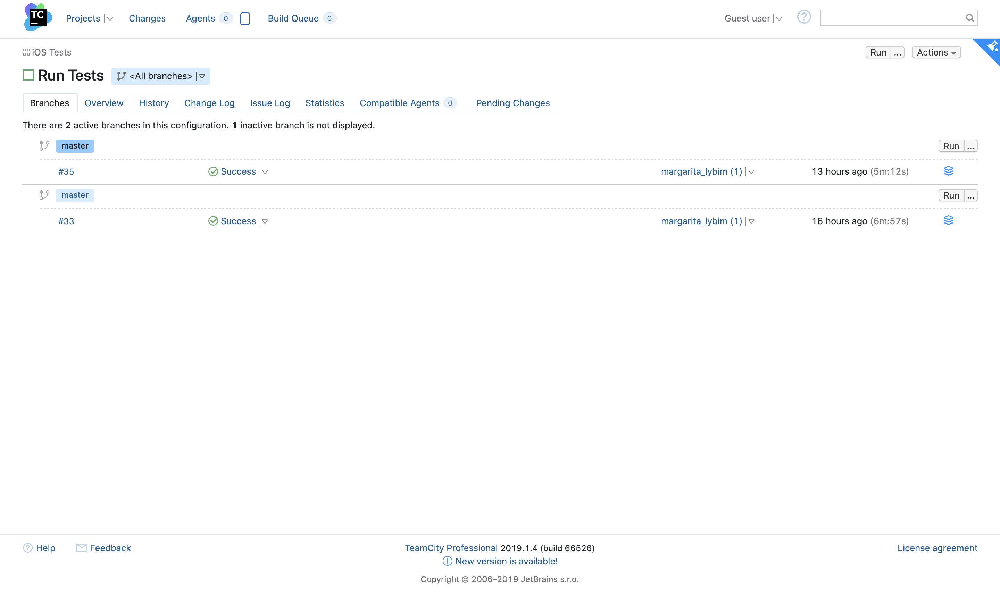
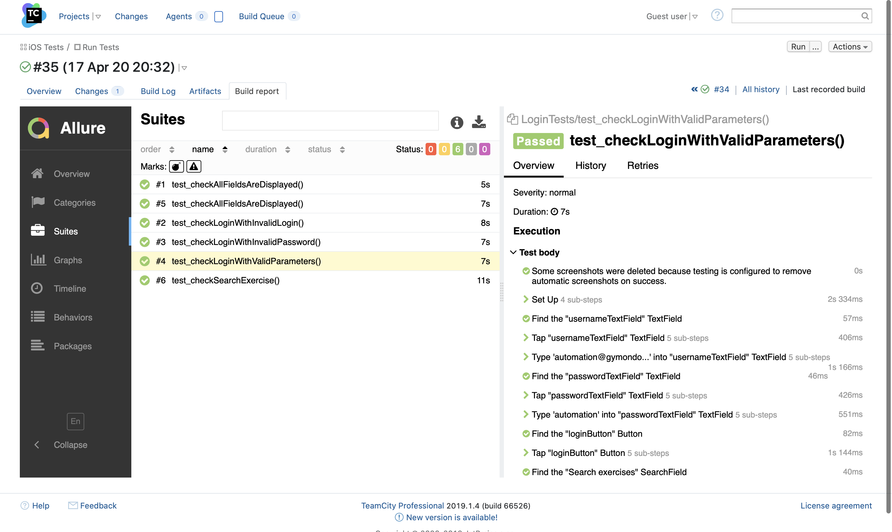
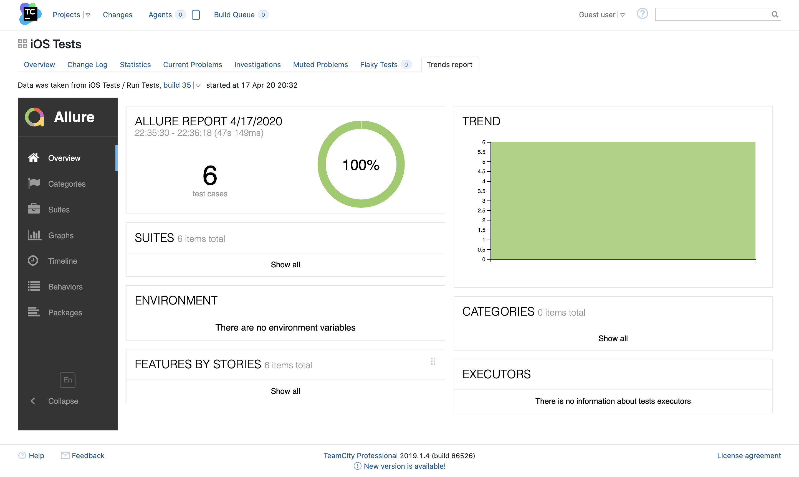

# qa-automation-ios-test

### Setup:
1) Install Xcode 11.3 or later as described [here](https://developer.apple.com/xcode/resources/)
  
2) [Fork](https://help.github.com/en/github/creating-cloning-and-archiving-repositories/cloning-a-repository) the repository to local.
  
3) Open the repository in Xcode and build the application. It is only possible to build the application on a simulator, not on a physical device.
  
4) The credentials to log into the app are `automation@gymondo.de`  /  `automation`

### How to run tests

- [via TeamCity](#How-to-run-via-TeamCity)
- [Locally](#How-to-run-locally)

### How to run via TeamCity

- Go to [CI page](http://34.89.223.149) hosted on GCE VM
- Login as a guest (no username or password required)
- Go to [Run iOS Tests project](http://34.89.223.149/viewType.html?buildTypeId=Run_iOS_Tests_ID) and click on run button

    

The first run takes around 10 minutes, because of starting new GCE VM with build runner and Bitrise setup.

You can also check logs and allure report on click on build

    

All artefacts are stored on cloud storage, so you can see historical report across all launches. For that go to [trends report tab of iOS Test project](http://34.89.223.149/project.html?projectId=iOS_Tests_ID&tab=preport_project3_Trends_report)

    

### How to run locally

Run using Xcode